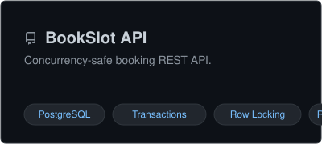
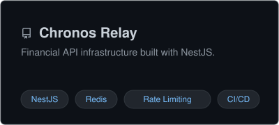
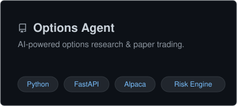

<div align="center">
  
</div>

<br/>

## 👨‍💻 Whoami

I build **backend systems, APIs, and developer infrastructure** primarily using **Python** and **TypeScript**. My work focuses on API design, concurrency, caching, external integrations, and reliability. 

## 🛠 Tech Stack

<p>
  
  
  
  
  
  
</p>

## 🏗 Featured Engineering Work

<table width="100%" border="0" cellpadding="0" cellspacing="0">
  <tr>
    <td width="50%" align="center">
      <a href="https://github.com/Ayotommy012/bookslot-api">
        
      </a>
    </td>
    <td width="50%" align="center">
      <a href="https://github.com/Ayotommy012/Chronos-Relay">
        
      </a>
    </td>
  </tr>
  <tr>
    <td width="50%" align="center">
      <br/>
      <a href="https://github.com/Ayotommy012/options-agent">
        
      </a>
    </td>
    <td width="50%" align="center">
      <br/>
      <a href="https://chronos-relay.onrender.com"><em>🔗 View Live: Chronos Relay API Proxy</em></a>
    </td>
  </tr>
</table>

## 🚧 Currently Building: WebhookOps

*Designing a resilient webhook delivery system.*

```text
[Webhook] -> [Verify HMAC] -> [Persist] -> [Queue] -> [Deliver]
                                                        |
                                                  [Retry Backoff]
                                                        |
                                                      [DLQ]
```

## 📊 GitHub Activity

<p align="center">
  
</p>

### Recent Commits
<!--START_SECTION:activity-->
<!--END_SECTION:activity-->

## 📬 Contact

<a href="https://www.linkedin.com/in/israel-apelegan-b5269b249/">
  
</a>
<a href="https://github.com/Ayotommy012">
  
</a>
